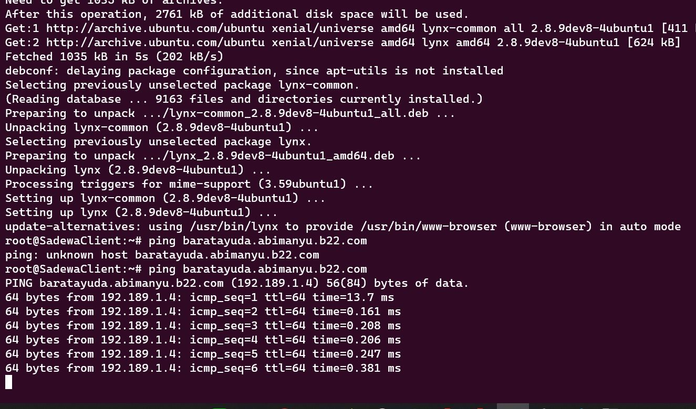
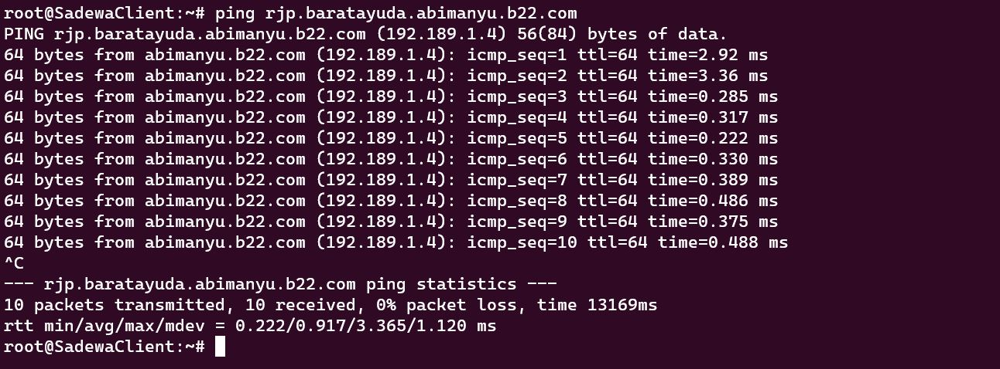
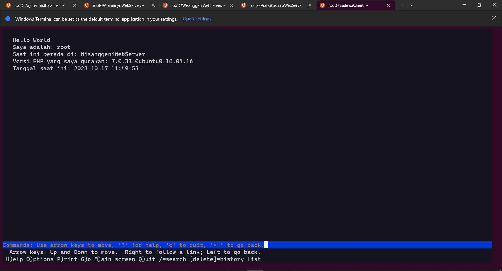
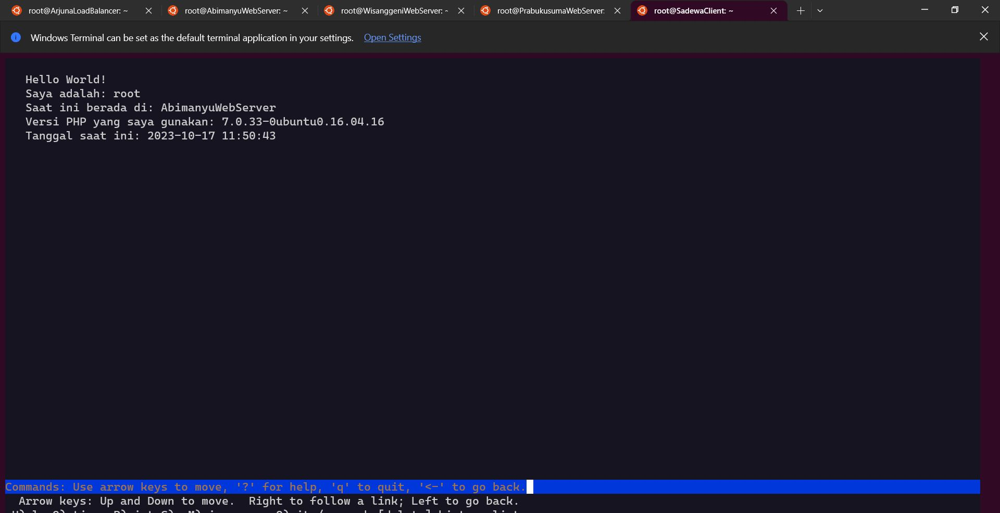
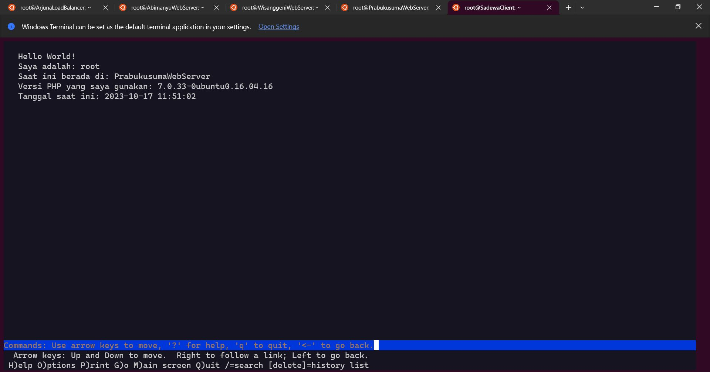
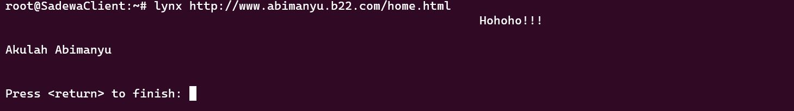
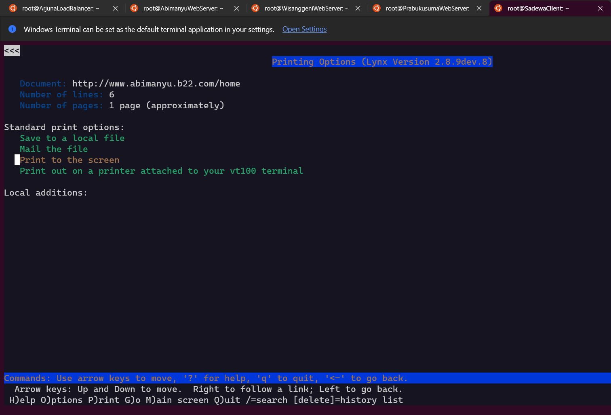

# Jarkom-Modul-2-B22-2023

# 1.

`Yudhistira akan digunakan sebagai DNS Master, Werkudara sebagai DNS Slave, Arjuna merupakan Load Balancer yang terdiri dari beberapa Web Server yaitu Prabakusuma, Abimanyu, dan Wisanggeni. Buatlah topologi dengan pembagian sebagai berikut. Folder topologi dapat diakses pada drive berikut `


Configure router:
```
# DHCP config for eth0
auto eth0
iface eth0 inet dhcp
hostname ubuntu-1-1

# Static config for eth1
auto eth1
iface eth1 inet static
	address 192.189.1.1
	netmask 255.255.255.0

# Static config for eth2
auto eth2
iface eth2 inet static
	address 192.189.2.1
	netmask 255.255.255.0
```

Configure NakulaClient:
```
# Static config for eth0
auto eth0
    iface eth0 inet static
        address 192.189.1.2
        netmask 255.255.255.0
        gateway 192.189.1.1
```

Configure SadewaCLient:
```
auto eth0
    iface eth0 inet static
        address 192.189.1.3
        netmask 255.255.255.0
        gateway 192.189.1.1
```

Configure AbimanyuWebServer:
```
auto eth0
    iface eth0 inet static
        address 192.189.1.4
        netmask 255.255.255.0
        gateway 192.189.1.1
```

Configure PrabukusumaWebServer:
```
auto eth0
    iface eth0 inet static
        address 192.189.1.5
        netmask 255.255.255.0
        gateway 192.189.1.1
```

Configure WisanggeniWebServer:
```
auto eth0
    iface eth0 inet static
        address 192.189.1.6
        netmask 255.255.255.0
        gateway 192.189.1.1
```

Configure YudhistiraDNSMaster:
```
auto eth0
    iface eth0 inet static
        address 192.189.2.2
        netmask 255.255.255.0
        gateway 192.189.2.1
```

Configure WerkudaraDNSSlave:
```
auto eth0
    iface eth0 inet static
        address 192.189.2.3
        netmask 255.255.255.0
        gateway 192.189.2.1
```

Configure ArjunaLoadBalancer:
```
auto eth0
    iface eth0 inet static
        address 192.189.2.4
        netmask 255.255.255.0
        gateway 192.189.2.1
```


# 2.

`Buatlah website utama pada node arjuna dengan akses ke arjuna.yyy.com dengan alias www.arjuna.yyy.com dengan yyy merupakan kode kelompok.`

Tambahkan script berikut pada node YudhistiraDNSMaster, pada file `/etc/bind/named.conf.local`
```sh
zone "arjuna.b22.com" {
        type master;
        file "/etc/bind/arjuna/arjuna.b22.com";
};
```
Dan tambahkan script berikut pada file `/etc/bind/arjuna/arjuna.b22.com`
```sh
;
; BIND data file for local loopback interface
;
$TTL    604800
@       IN      SOA     arjuna.b22.com. root.arjuna.b22.com. (
                            2023101101         ; Serial
                         604800         ; Refresh
                          86400         ; Retry
                        2419200         ; Expire
                         604800 )       ; Negative Cache TTL
;
@       IN      NS      arjuna.b22.com.
@       IN      A       192.189.2.4     ; IP Arjuna
www     IN      CNAME   arjuna.b22.com.
@       IN      AAAA    ::1
```


# 3.

`Dengan cara yang sama seperti soal nomor 2, buatlah website utama dengan akses ke abimanyu.yyy.com dan alias www.abimanyu.yyy.com.`

Tambahkan script berikut pada node YudhistiraDNSMaster, pada file `/etc/bind/named.conf.local`
```sh
zone "abimanyu.b22.com" {
       type master;
        file "/etc/bind/abimanyu/abimanyu.b22.com";
};
```
Dan tambahkan script berikut pada file `/etc/bind/abimanyu/abimanyu.b22.com`
```sh
;
; BIND data file for local loopback interface
;
$TTL    604800
@       IN      SOA     abimanyu.b22.com. root.abimanyu.b22.com. (
                     2023101101         ; Serial
                         604800         ; Refresh
                          86400         ; Retry
                        2419200         ; Expire
                         604800 )       ; Negative Cache TTL
;
@       IN      NS      abimanyu.b22.com.
@       IN      A       192.189.1.4     ; IP Abimanyu
www     IN      CNAME   abimanyu.b22.com.
@       IN      AAAA    ::1
```


# 4.

`Kemudian, karena terdapat beberapa web yang harus di-deploy, buatlah subdomain parikesit.abimanyu.yyy.com yang diatur DNS-nya di Yudhistira dan mengarah ke Abimanyu.`

Tambahkan script berikut pada node YudhistiraDNSMaster, pada file `/etc/bind/abimanyu/abimanyu.b22.com`
```sh
parikesit       IN      A       192.189.1.4     ; IP abimanyu
www.parikesit   IN      CNAME   abimanyu.b22.com.
```


# 5.

`Buat juga reverse domain untuk domain utama. (Abimanyu saja yang direverse)`

Tambahkan script berikut pada node YudhistiraDNSMaster, pada file `/etc/bind/named.conf.local`
```sh
zone "1.189.192.in-addr.arpa" {
    type master;
    file "/etc/bind/abimanyu/1.189.192.in-addr.arpa";
};
```
Dan tambahkan script berikut pada file `/etc/bind/abimanyu/1.189.192.in-addr.arpa`
```sh
;
; BIND data file for local loopback interface
;
$TTL    604800
@       IN      SOA     abimanyu.b22.com. root.abimanyu.b22.com. (
                            2023101101         ; Serial
                         604800         ; Refresh
                          86400         ; Retry
                        2419200         ; Expire
                         604800 )       ; Negative Cache TTL
;
1.189.192.in-addr.arpa.          IN      NS      abimanyu.b22.com.
4                                IN      PTR      abimanyu.b22.com. ; Byte ke-4 IP abimanyu
```


# 6.

`Agar dapat tetap dihubungi ketika DNS Server Yudhistira bermasalah, buat juga Werkudara sebagai DNS Slave untuk domain utama.`

Edit script menjadi seperti berikut pada node YudhistiraDNSMaster, pada file `/etc/bind/named.conf.local`
```sh
zone "arjuna.b22.com" {
        type master;
        notify yes;
        also-notify { 192.189.2.3; };
        allow-transfer { 192.189.2.3; };
        file "/etc/bind/arjuna/arjuna.b22.com";
};
zone "abimanyu.b22.com" {
        type master;
        notify yes;
        also-notify { 192.189.2.3; };
        allow-transfer { 192.189.2.3; };
        file "/etc/bind/arjuna/abimanyu.b22.com";
};
```
Dan pada node WerkudaraDNSSlave, pada file `/etc/bind/named.conf.local`
```sh
zone "arjuna.b22.com" {
        type slave;
        masters { 192.189.2.2; };
        file "/var/lib/bind/arjuna.b22.com";
};
zone "abimanyu.b22.com" {
        type slave;
        masters { 192.189.2.2; };
        file "/var/lib/bind/abimanyu.b22.com";
};
```


<br>


# 7.

`Seperti yang kita tahu karena banyak sekali informasi yang harus diterima, buatlah subdomain khusus untuk perang yaitu baratayuda.abimanyu.yyy.com dengan alias www.baratayuda.abimanyu.yyy.com yang didelegasikan dari Yudhistira ke Werkudara dengan IP menuju ke Abimanyu dalam folder Baratayuda.`

### Pada Yudhistira

#### Pada /etc/bind/abimanyu/abimanyu.b22.com tambahkan

```
nsl             IN      A       192.189.2.3     
baratayuda      IN      NS      nsl
```

#### Pada /etc/bind/named.conf.options tambahkan

`allow-query{ any; };`

#### Dan komentar dnssec-validation auto

### Pada Werkudara

#### Pada /etc/bind/named.conf.local tambahkan

```
echo 'zone "baratayuda.abimanyu.b22.com" {
        type master;
        file "/etc/bind/baratayuda/baratayuda.abimanyu.b22.com";
};
```

#### Pada /etc/bind/baratayuda/baratayuda.abimanyu.b22.com

```
;
; BIND data file for local loopback interface
;
$TTL    604800
@       IN      SOA     baratayuda.abimanyu.b22.com. root.baratayuda.abimanyu.b22.com. (
                        2023101201      ; Serial
                         604800         ; Refresh
                          86400         ; Retry
                        2419200         ; Expire
                         604800 )       ; Negative Cache TTL
;
@       IN      NS      baratayuda.abimanyu.b22.com.
@       IN      A       192.189.1.4     ; IP Abimanyu
www     IN      CNAME   baratayuda.abimanyu.b22.com.
rjp     IN      A       192.189.1.4     ; IP Abimanyu
www.rjp IN      CNAME   rjp.baratayuda.abimanyu.b22.com.
```

**NOTE :** Kami lupa memberikan kurung buka setelah "@ IN SOA ..." sehingga versi yang kami kumpulkan tidak bisa berjalan.


#### Pada /etc/bind/named.conf.options tambahkan

`allow-query{ any; };`

#### Dan komentar dnssec-validation auto




# 8. 

`Untuk informasi yang lebih spesifik mengenai Ranjapan Baratayuda, buatlah subdomain melalui Werkudara dengan akses rjp.baratayuda.abimanyu.yyy.com dengan alias www.rjp.baratayuda.abimanyu.yyy.com yang mengarah ke Abimanyu.`

#### Pada /etc/bind/baratayuda/baratayuda.abimanyu.b22.com

```
....
rjp     IN      A       192.189.1.4     ; IP Abimanyu
www.rjp IN      CNAME   rjp.baratayuda.abimanyu.b22.com.
....
```



# 9. 

`Arjuna merupakan suatu Load Balancer Nginx dengan tiga worker (yang juga menggunakan nginx sebagai webserver) yaitu Prabakusuma, Abimanyu, dan Wisanggeni. Lakukan deployment pada masing-masing worker.`

## NOTE :
1. Untuk worker, shell script harus dijalankan secara manual `bash setup.sh`.
2. Karena file website arjuna sudah diunduh di /root, maka unzip akan bertanya untuk replace atau tidak.

## 1. Install Nginx + PHP

```
apt-get update
apt-get install nginx php php-fpm wget unzip -y
```

## 2. Download website arjuna dan deploy di worker

### Download Website

1. **install wget**, lalu download archive berisi .php website, disimpan di `root`.

    `wget --no-check-certificate 'https://docs.google.com/uc?export=download&id=[ID FILE]' -O [NAMA FILE AKHIR].zip`

    ID File bisa ditemukan di link file sharing jika terbuka untuk umum. Contoh :

    https://drive.google.com/file/d/**1C_vxlB4AqmSdyRs7rNA10sD1g2mSXOkC**/view?usp=sharing

2. **install unzip**, lalu extract isi file ke dalam root
3. Shell Script : Pindahkan index.php ke /var/www/html/

### Setup configurasi worker di /etc/nginx/sites-available/arjuna

#### NOTE : PORT setiap worker berbeda antara 8001-8003, sesuai dengan nomor 10

```
listen 8003;

 root /var/www/arjuna;

 index index.php index.html index.htm;
 server_name _;

 location / {
                try_files $uri $uri/ /index.php?$query_string;
 }

 # pass PHP scripts to FastCGI server
 location ~ \.php$ {
 include snippets/fastcgi-php.conf;
 fastcgi_pass unix:/var/run/php/php7.0-fpm.sock;
 }

location ~ /\.ht {
                deny all;
}
error_log /var/log/nginx/arjuna_error.log;
access_log /var/log/nginx/arjuna_access.log;
}
```

### Create symlink dan nyalakan nginx + php

```
 ln -s /etc/nginx/sites-available/arjuna /etc/nginx/sites-enabled
rm -rf /etc/nginx/sites-enabled/default
service nginx start
 service nginx restart
service php7.0-fpm start
```

## 3. Setup load balancing di arjuna /etc/nginx/sites-available/lb-arjuna
```
# Default menggunakan Round Robin
upstream myweb  {
server 192.189.1.4:8001; #IP Abimanyu
server 192.189.1.5:8003;
server 192.189.1.6:8002;
}

server {
listen 80;
server_name arjuna.b22.com www.arjuna.b22.com;

location / {
proxy_pass http://myweb;
}
}
```

### Create symlink dan nyalakan nginx + php

```
ln -s /etc/nginx/sites-available/lb-arjuna /etc/nginx/sites-enabled

rm -rf /etc/nginx/sites-enabled/default
service nginx start
service nginx restart
service php7.0-fpm start
```

# 10. 

`Kemudian gunakan algoritma Round Robin untuk Load Balancer pada Arjuna. Gunakan server_name pada soal nomor 1. Untuk melakukan pengecekan akses alamat web tersebut kemudian pastikan worker yang digunakan untuk menangani permintaan akan berganti ganti secara acak. Untuk webserver di masing-masing worker wajib berjalan di port 8001-8003. Contoh :`

```
Prabakusuma:8001
Abimanyu:8002
Wisanggeni:8003
```

Pada config nginx, worker diminta mendengarkan port sesuai instruksi soal dan pada arjuna, diset menggunakan `upstream` (round robin) dan diberikan port untuk setiap ip worker.

### Foto round robin + bukti no 9







# 11. 

`Selain menggunakan Nginx, lakukan konfigurasi Apache Web Server pada worker Abimanyu dengan web server www.abimanyu.yyy.com. Pertama dibutuhkan web server dengan DocumentRoot pada /var/www/abimanyu.yyy`

### Install Apache2 (bersama wget dan unzip     )

```
apt-get install wget unzip apache2 -y
service apache2 start
```

### Download file website Abimanyu

```
apt-get install wget unzip -y
wget --no-check-certificate 'https://docs.google.com/uc?export=download&id=1a4V23hwK9S7hQEDEcv9FL14UkkrHc-Zc' -O abimanyu.com.zip
unzip abimanyu.com.zip
cp -r /root/abimanyu.yyy.com/ /var/www/abimanyu.b22

```

### Copy file 000-default.conf menjadi file abimanyu.b22.com.conf lalu setup isinya

**DIBAWAH ADALAH PERINTAH BASH**

```
cp /etc/apache2/sites-available/000-default.conf /etc/apache2/sites-available/abimanyu.b22.com.confecho '
<VirtualHost *:80>

        ServerAdmin webmaster@localhost
        DocumentRoot /var/www/abimanyu.b22

ServerName abimanyu.b22.com
ServerAlias www.abimanyu.b22.com
        ErrorLog ${APACHE_LOG_DIR}/error.log
        CustomLog ${APACHE_LOG_DIR}/access.log combined

</VirtualHost>

<Directory /var/www/>
        Options Indexes FollowSymLinks
        AllowOverride All
        Require all granted
</Directory>

# vim: syntax=apache ts=4 sw=4 sts=4 sr noet
' > /etc/apache2/sites-available/abimanyu.b22.com.conf
```

- Tambah : DocumentRoot /var/www/abimanyu.b22

Mengubah root server sesuai directory yang diberikan.

- Tambahkan www

    ```
    ServerName abimanyu.b22.com
    ServerAlias www.abimanyu.b22.com
    ```

Memberi alias domain dengan www

### Aktifkan configurasi

`a2ensite abimanyu.b22.com`




----
# 12. 

`Setelah itu ubahlah agar url www.abimanyu.yyy.com/index.php/home menjadi www.abimanyu.yyy.com/home.`

### Aktifkan apache2 mod untuk url rewrite

```
a2enmod rewrite
```

#### NOTE : Untuk rewrite, di file abimanyu.b22.com.conf harus ditambah "AllowOverride All" untuk directory yang akan direwrite agar bisa dioverwrite.

Contoh :

```
<Directory /var/www/>
        Options Indexes FollowSymLinks
        AllowOverride All
        Require all granted
</Directory>
``` 
---
### Buat file .htaccess di directory yang ingin direwrite (Sesuai directory yang ditambahkan file conf)

```
RewriteEngine on
RewriteCond %{REQUEST_URI} ^/index\.php/home$
RewriteRule ^index\.php/(.*)$ /$1 [L,R=301]
```
Penjelasan :
1. Hanya www.abimanyu.b22.com/index.php/home (index.php/home tepat setelah .com dan tidak ada lanjutannya)
2. Jika index.php/home ditemukan, maka pisah menjadi "index.php" dan directory setelahnya, lalu ganti link menjadi link tanpa "index.php" pertama tersebut (hanya menyimpan directory setelahnya).
3. R = Redirect + L = if the rule matches, no further rules will be processed



# 13.

`Selain itu, pada subdomain www.parikesit.abimanyu.yyy.com, DocumentRoot disimpan pada /var/www/parikesit.abimanyu.yyy`

# 14.

`Pada subdomain tersebut folder /public hanya dapat melakukan directory listing sedangkan pada folder /secret tidak dapat diakses (403 Forbidden).`

# 15.

`Buatlah kustomisasi halaman error pada folder /error untuk mengganti error kode pada Apache. Error kode yang perlu diganti adalah 404 Not Found dan 403 Forbidden.`

# 16.

`Buatlah suatu konfigurasi virtual host agar file asset www.parikesit.abimanyu.yyy.com/public/js menjadi 
www.parikesit.abimanyu.yyy.com/js`

# 17.

`Agar aman, buatlah konfigurasi agar www.rjp.baratayuda.abimanyu.yyy.com hanya dapat diakses melalui port 14000 dan 14400.`

# 18.

`Untuk mengaksesnya buatlah autentikasi username berupa “Wayang” dan password “baratayudayyy” dengan yyy merupakan kode kelompok. Letakkan DocumentRoot pada /var/www/rjp.baratayuda.abimanyu.yyy.`

# 19.

`Buatlah agar setiap kali mengakses IP dari Abimanyu akan secara otomatis dialihkan ke www.abimanyu.yyy.com (alias)`

# 20.

`Karena website www.parikesit.abimanyu.yyy.com semakin banyak pengunjung dan banyak gambar gambar random, maka ubahlah request gambar yang memiliki substring “abimanyu” akan diarahkan menuju abimanyu.png.`


# Kesulitan

### Permission denied /etc/bind/rndc.key 

```
11-Oct-2023 09:16:32.794 configuring command channel from '/etc/bind/rndc.key'
11-Oct-2023 09:16:32.794 open: /etc/bind/rndc.key: permission denied
11-Oct-2023 09:16:32.794 couldn't add command channel 127.0.0.1#953: permission denied
11-Oct-2023 09:16:32.794 configuring command channel from '/etc/bind/rndc.key'
11-Oct-2023 09:16:32.794 open: /etc/bind/rndc.key: permission denied
11-Oct-2023 09:16:32.794 couldn't add command channel ::1#953: permission denied
11-Oct-2023 09:16:32.794 not using config file logging statement for logging due to -g option
11-Oct-2023 09:16:32.794 managed-keys-zone: loaded serial 2
11-Oct-2023 09:16:32.795 zone 0.in-addr.arpa/IN: loaded serial 1
11-Oct-2023 09:16:32.798 zone 127.in-addr.arpa/IN: loaded serial 1
```
Solusi :
`chown root:bind /etc/bind/rndc.key`

### Untuk abimanyu, www.abimanyu.yyy.com/index.php/home tidak bisa menampilkan isi file html, harus diakses manual.

Belum ditemukan solusi.
